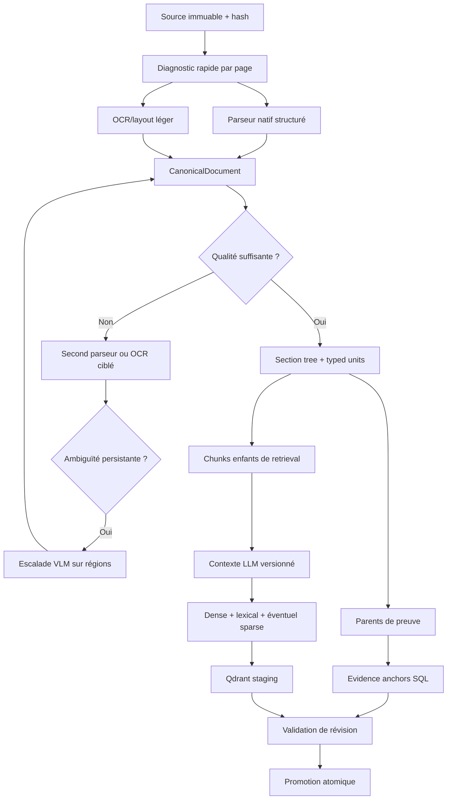

# Audit approfondi de l’ingestion, de l’OCR et de l’indexation

Date de l’audit : 26 juillet 2026

Projet : SAAIA RAG V3.1

Branche observée : `SAAIA_V3.1`

Commit observé : `78226a74`

Portée : analyse et recommandations. Ce rapport ne modifie pas encore le pipeline de production.

## 1. Verdict exécutif

Le pipeline actuel n’est pas à jeter. Il possède déjà plusieurs fondations sérieuses :

- calcul de hash du fichier et gestion de révisions ;
- file de travaux, reprise et progression ;
- publication PostgreSQL transactionnelle ;
- filtrage de la version active lors de la recherche ;
- indexation dense, recherche lexicale, fusion et reranking ;
- diagnostics de qualité, limites de concurrence et télémétrie ;
- une quantité importante de tests unitaires et d’intégration.

Le défaut architectural principal se situe cependant avant l’index vectoriel :

> Le système extrait d’abord un texte essentiellement plat, perd très tôt les coordonnées, la structure de page et la provenance fine, puis tente de reconstruire les titres, sections, unités, recettes, tableaux et cartes de contenu au moyen d’un grand nombre de regex, de règles et de migrations correctives.

Cette perte initiale explique une grande partie des problèmes rencontrés ensuite :

- mauvais ordre de lecture dans les pages complexes ;
- titres inventés, fusionnés ou tronqués ;
- doublons et « cartes » qui sont en réalité des instructions, des fragments de tableau ou du bruit OCR ;
- source fichier/page connue globalement, mais ancrage mécanique trop faible pour une affirmation, une cellule ou un titre précis ;
- multiplication de correctifs dans l’ingestion et jusque dans la recherche ;
- impossibilité de comparer proprement deux versions du parseur ;
- tests verts qui ne mesurent pas la fidélité réelle des documents.

Le bon objectif n’est donc pas d’ajouter encore quelques regex. Il faut introduire une représentation canonique et conservatrice du document, avec structure, coordonnées, ordre de lecture, types de blocs, confiance et provenance. Les chunks, cartes, index et citations devront être des projections versionnées de cette représentation.

La recommandation prioritaire est la suivante :

1. construire un corpus de référence représentatif et les métriques avant de choisir un nouveau parseur ;
2. définir un `CanonicalDocument` et un `IngestionManifest` immuables ;
3. comparer le parseur actuel à Docling, PaddleOCR/PP-Structure et quelques alternatives sur les vrais documents SAAIA et le matériel cible ;
4. intégrer le meilleur ensemble sous forme d’adaptateurs, avec traitement par page et escalade contrôlée ;
5. reconstruire sections, unités, chunks et cartes à partir de blocs structurés ;
6. réindexer dans un index parallèle, mesurer, puis promouvoir ou revenir en arrière.

Docling est le candidat initial le plus cohérent à expérimenter en premier pour SAAIA : représentation riche, boîtes englobantes, ordre de lecture, tables, hiérarchie, chunking natif, licence MIT et exécution annoncée sur du matériel courant. Ce n’est toutefois pas une conclusion de benchmark : il doit être comparé factuellement aux autres candidats sur les documents et machines du projet.

## 2. Ce que signifie « parfait »

Un pipeline documentaire ne peut pas être déclaré parfait dans l’absolu. Il peut être rendu excellent et maîtrisé si la perfection devient un contrat opérationnel mesurable :

- aucun contenu source n’est supprimé sans conservation de la version brute et du motif ;
- chaque élément dérivé peut être relié à un fichier, une révision, une page et une ou plusieurs régions ;
- chaque table conserve ses cellules, en-têtes et relations ;
- l’ordre de lecture est explicite et inspectable ;
- les transformations sont versionnées et reproductibles ;
- les documents difficiles sont détectés et routés vers une méthode plus robuste ;
- les échecs partiels ne publient pas un index incohérent ;
- la qualité est mesurée sur un corpus réel, pas seulement sur des chaînes synthétiques ;
- une nouvelle version n’est promue que si elle dépasse l’ancienne selon des seuils convenus ;
- les citations de la réponse reposent sur des ancres stables et non sur une ressemblance textuelle tardive.

Cette définition protège aussi le rôle du LLM :

- le code produit, transporte et vérifie mécaniquement les preuves ;
- le LLM reste l’orchestrateur et le décideur sémantique ;
- les règles ne doivent pas décider à sa place quelle recette, section ou source est pertinente ;
- une heuristique mécanique peut signaler une extraction douteuse, mais pas transformer silencieusement un fragment en vérité sémantique.

## 3. Méthode de l’audit

L’audit s’appuie sur :

- la lecture du CDC V3.1 et de l’ADR source-backed ;
- le parcours du flux depuis la surveillance des fichiers jusqu’à PostgreSQL et Qdrant ;
- l’inspection des modèles persistés pour les pages, sections, unités, chunks et profils ;
- l’analyse des traitements OCR natif, OCRmyPDF, Ghostscript et Tesseract ;
- l’inspection des tests ciblés et de leur condition d’exécution ;
- l’inspection d’artefacts réels d’extraction et de cartes de contenu ;
- la comparaison avec la documentation primaire de Docling, PaddleOCR, MinerU, OCRmyPDF, Tesseract, Unstructured, Qdrant, TEI, Ragas, OmniDocBench, ParseBench et DocLayNet.

État important du dépôt au moment de l’audit :

- le dépôt contient déjà un très grand nombre de modifications locales ;
- elles n’ont pas été nettoyées ni réinitialisées par cet audit ;
- les constats concernent l’état observé, pas uniquement le dernier commit Git.

## 4. Cartographie du pipeline actuel

```mermaid
flowchart LR
    A["Surveillance et scan des PDF"] --> B["Hash et révision"]
    B --> C["PdfPig : mots et coordonnées"]
    C --> D["Reconstruction en texte plat"]
    D --> E{"OCR recommandé ?"}
    E -->|Document| F["OCRmyPDF : sidecar texte"]
    E -->|Pages avec images ou texte faible| G["Ghostscript + Tesseract TSV"]
    F --> H["Remplacement ou fusion de texte"]
    G --> H
    H --> I["Détection regex des sections"]
    I --> J["Détection regex des unités"]
    J --> K["Projection des chunks"]
    K --> L["Texte contextuel et embeddings"]
    L --> M["Qdrant"]
    K --> N["Profils et cartes de contenu"]
    M --> O["Publication SQL de la révision"]
    N --> O
```



Flux principal observé dans `backend/SAAIA.Backend/Ingestion/IngestionWorker.cs` :

1. lecture et hash du PDF ;
2. extraction native avec `PdfExtractor` ;
3. décision OCR ;
4. OCR complet et/ou OCR de pages avec images ;
5. extraction de sections ;
6. extraction d’unités ;
7. projection des chunks de recherche ;
8. construction des entrées exactes et contextuelles ;
9. calcul des embeddings ;
10. écriture Qdrant ;
11. publication de la fondation documentaire dans PostgreSQL ;
12. nettoyage des anciennes versions vectorielles.

Le flux est cohérent du point de vue du traitement, mais la représentation intermédiaire est insuffisante : après l’extraction native, la plupart des étapes travaillent sur du texte plat.

## 5. Fondations à conserver

### 5.1 Identité du document et gestion de révision

Le hash de la source, le chemin, la taille, la date, la révision et la version indexée fournissent déjà une base de traçabilité utile. Il faut l’enrichir plutôt que la remplacer.

### 5.2 Publication SQL atomique

`DocumentFoundationRepo.PublishUpsertCompletionAsync` et les opérations associées publient la fondation documentaire et basculent la version active dans une transaction PostgreSQL. C’est une propriété essentielle.

La recommandation n’est pas de casser ce mécanisme, mais d’y rattacher un manifeste complet et un index vectoriel de staging validé.

### 5.3 Défense contre les révisions vectorielles obsolètes

L’écriture Qdrant précède la publication SQL, mais les recherches filtrent la version active. Une écriture vectorielle partielle ne devient donc normalement pas la vérité active. Il reste à mieux traiter les vecteurs orphelins et la promotion coordonnée.

### 5.4 Recherche déjà hybride

Le système possède déjà :

- correspondances exactes ;
- recherche lexicale PostgreSQL ;
- recherche dense Qdrant ;
- fusion de rangs ;
- reranker servi par TEI.

Il serait incorrect de conclure que le projet doit « ajouter du RAG hybride » comme s’il n’existait pas. L’amélioration doit porter sur :

- la qualité des unités indexées ;
- la vraie nature du score lexical ;
- les ancres et métadonnées ;
- l’évaluation des paramètres de fusion et de reranking.

### 5.5 Résilience opérationnelle

Les bulkheads, limites de concurrence, heartbeats, reprises et métriques de durée sont une bonne base pour prendre en charge plusieurs profils matériels.

## 6. Problèmes critiques

## P0 — La structure spatiale est perdue trop tôt

`PdfExtractor` obtient les mots et leurs coordonnées avec PdfPig (`PdfExtractor.cs`, autour de la ligne 91). Ces coordonnées servent à reconstruire du texte, mais le modèle persistant `ExtractedPdfPage` ne conserve ensuite que :

- numéro de page ;
- texte plat ;
- nombre de mots et de caractères ;
- checksum ;
- qualité sommaire ;
- nombre d’images.

Il ne conserve pas :

- boîtes des mots, lignes et blocs ;
- police, taille, graisse ou style ;
- type de bloc ;
- rotation ;
- colonnes ;
- ordre de lecture explicite et sa confiance ;
- cellules et bordures de table ;
- liens entre figure et légende ;
- hiérarchie de listes ;
- position exacte d’un titre ;
- span brut correspondant à chaque texte dérivé.

Conséquence : le pipeline ne peut plus savoir mécaniquement qu’un élément vient du bloc `(x1, y1, x2, y2)` de la page 37. Il connaît la page, mais pas la preuve spatiale précise.

L’artefact `artifacts/pdf-extraction-audit/current-extraction.txt` montre déjà un exemple de lecture désordonnée où des fragments comme « PETITS », « QUICHE À LA CLÉRIOT », « DÉJ », « INGRÉDIENTS » et « PRÉPARATION » ne sont pas restitués dans une structure fiable.

### Correctif architectural

Introduire une représentation canonique contenant au minimum :

```text
Document
  Revision
  Pages
    Page geometry, rotation, image coverage, language
    Blocks
      stable block id
      type
      bounding polygon
      reading-order index
      raw text
      normalized text
      confidence
      extraction method
      spans/words
    Tables
      table box
      rows, columns, cells, merged cells, headers
    Figures
      figure box, caption link, optional visual asset
  Section tree
  Source anchors
  Processing manifest
```

Les sections, chunks et cartes deviennent ensuite des vues dérivées de cette représentation, pas des objets qui tentent de réinventer la page.

## P0 — Les preuves ne possèdent pas encore une ancre source assez fine

Les pages, unités et chunks disposent de pages et parfois d’offsets. Ces offsets sont toutefois calculés dans du texte dérivé puis le chunk peut être renormalisé et préfixé.

Dans `RetrievalChunkProjector.cs` :

- `NormalizeRetrievalText` effectue de nombreuses substitutions ;
- `PrefixDetectedEmbeddedTitle` peut ajouter un titre détecté au début ;
- le checksum porte sur ce texte transformé ;
- les offsets reçus proviennent des unités avant cette dernière transformation.

L’offset n’est donc pas une preuve fiable dans le PDF d’origine.

Une ancre stable devrait ressembler à :

```json
{
  "documentHash": "...",
  "revisionId": "...",
  "page": 37,
  "blockIds": ["p37-b014", "p37-b015"],
  "spanIds": ["p37-b014-s02"],
  "polygon": [x1, y1, x2, y2],
  "rawTextHash": "...",
  "parserManifestHash": "..."
}
```

Le lien fichier/page dans l’interface devient alors la présentation d’une preuve beaucoup plus forte. Une citation de cellule peut même surligner la cellule exacte.

## P0 — La version de révision ne fige pas le pipeline qui l’a produite

La table `document_revisions` conserve le hash source, la taille, la date et les versions d’ingestion/indexation. Elle ne fige pas explicitement :

- parseur et version ;
- modèle de layout et hash ;
- moteur OCR, version, langues et tessdata ;
- réglages de rendu et prétraitement ;
- algorithme de lecture ;
- chunker et version ;
- tokenizer et version ;
- contextualiseur, modèle, prompt et version ;
- modèle d’embedding et révision exacte ;
- schéma de payload Qdrant ;
- projecteur de profil et prompt d’enrichissement.

La reprise de l’ingestion vérifie essentiellement :

- hash de la source ;
- nombre total de chunks ;
- modèle d’embedding ;
- format de l’entrée d’embedding.

Deux algorithmes différents peuvent produire le même nombre de chunks. Une reprise peut alors réutiliser un état qui n’est plus compatible.

### Correctif

Créer un `IngestionManifest` sérialisé, hashé et attaché à chaque révision :

```json
{
  "schemaVersion": "canonical-document-v1",
  "extractor": {"name": "docling", "version": "...", "modelHashes": []},
  "ocr": {"engine": "...", "version": "...", "languages": [], "optionsHash": "..."},
  "layout": {"model": "...", "revision": "..."},
  "chunker": {"name": "...", "version": "...", "tokenizer": "..."},
  "contextualizer": {"model": "...", "promptHash": "..."},
  "embedding": {"model": "...", "revision": "...", "dimensions": 0},
  "profile": {"schema": "...", "projectorVersion": "...", "promptHash": "..."},
  "vectorPayloadSchema": "...",
  "codeRevision": "..."
}
```

Le hash complet du manifeste doit participer à :

- la compatibilité de reprise ;
- l’identité des artefacts ;
- la décision de réingestion ;
- le rapport de comparaison ;
- la capacité de rollback.

## P0 — L’évaluation ne mesure pas la fidélité documentaire réelle

Une exécution ciblée finale de 435 tests couvrant notamment extraction, OCR, sections, unités, chunks, profils, contextualisation, Qdrant et fondation documentaire s’est terminée avec 435 réussites, 0 échec et 0 test marqué ignoré. Ce résultat est utile, mais il est trompeur s’il est interprété comme une validation OCR.

Le test `Real_scanned_pdf_ocr_extracts_text_when_opted_in` dans `PdfOcrTextExtractorTests.cs` fait simplement `return` si `SAAIA_TEST_OCR_E2E != 1`. Sur la machine auditée :

- `SAAIA_TEST_OCR_E2E` n’est pas défini ;
- `ocrmypdf` n’est pas trouvé ;
- `tesseract` n’est pas trouvé ;
- `gs` n’est pas trouvé.

VSTest comptabilise néanmoins la méthode comme réussie, pas comme ignorée.

Les nombreuses questions de validation « OCR imparfait » vérifient surtout le comportement RAG final. Elles ne possèdent pas un gold standard de :

- texte attendu par page ;
- boîtes attendues ;
- ordre de lecture ;
- structure des tableaux ;
- titres et niveaux ;
- relations entre légende et image ;
- zones à ignorer ou à conserver.

### Correctif

Créer trois couches d’évaluation :

1. **Parsing/OCR** : texte, mise en page, tables, ordre, ancrage.
2. **Index/retrieval** : chunks attendus, Recall@K, MRR, nDCG, diversité.
3. **Réponse** : couverture, foi aux sources, exactitude des citations, qualité de forme.

Le test OCR réel doit :

- être marqué explicitement `Skip` si les dépendances manquent, ou échouer dans le profil CI OCR ;
- utiliser plusieurs vrais documents versionnés ou un corpus d’essai légalement distribuable ;
- enregistrer versions des moteurs, durée, CPU/RAM/GPU et résultats ;
- comparer aux annotations, pas uniquement vérifier qu’une chaîne existe.

## P1 — L’extraction OCR est textuelle, pas documentaire

### OCR complet

OCRmyPDF produit un sidecar texte. Cette voie est solide pour rendre un PDF recherchable et récupérer du texte, mais le sidecar ne transporte pas toute la structure utile au RAG.

La documentation OCRmyPDF rappelle que Tesseract peut :

- produire du charabia ;
- mal gérer les langues non déclarées ;
- échouer sur l’ordre naturel, notamment les colonnes ;
- manquer de structure native car un PDF encode surtout des glyphes et positions.

Source : [OCRmyPDF — limitations](https://ocrmypdf.readthedocs.io/en/v8.2.2/introduction.html).

### OCR de pages avec images

La deuxième voie :

1. rend la page entière en PNG gris avec Ghostscript ;
2. lance Tesseract ;
3. lit le texte et le TSV ;
4. filtre des lignes selon des seuils de confiance ;
5. remplace la page ou ajoute des lignes jugées nouvelles.

Les problèmes sont les suivants :

- une page est candidate dès qu’elle contient une image, même si l’image est un petit logo ;
- le pourcentage de surface raster n’est pas mesuré ;
- en cas de plafond, les pages sont distribuées dans la liste plutôt que classées par risque ;
- le texte OCR nouveau peut être ajouté en fin de page, hors de sa position réelle ;
- les coordonnées et confiances TSV ne sont pas persistées ;
- le lien image/texte/légende est perdu ;
- les seuils de confiance suppriment des lignes entières ;
- le document peut être traité avec plusieurs langues simultanément sans décision par page ou région.

Tesseract sait pourtant exposer boîtes, hiérarchie et confiance en TSV/hOCR. Ces sorties devraient être intégrées au modèle canonique plutôt que réduites à du texte. Voir [Tesseract — utilisation en ligne de commande](https://tesseract-ocr.github.io/tessdoc/Command-Line-Usage.html).

### Langues

La détection de langues utilise notamment le nom de fichier, le dossier et les premières pages de texte natif. Pour un scan sans couche texte, le signal utile est faible. Un mélange large `fra+eng+deu+ita+spa` coûte plus cher et peut dégrader la reconnaissance.

Il faut :

- détecter script/langue sur un échantillon de pages ou régions ;
- conserver la décision et son score ;
- permettre des langues préférées par espace documentaire ;
- mesurer mono-langue contre multi-langue ;
- escalader seulement les pages ambiguës.

### Prétraitement

La documentation Tesseract insiste sur la résolution, l’inclinaison, le bruit, les bordures et le bon mode de segmentation. Une valeur PSM unique n’est pas optimale pour une page à une colonne, une grille de recettes, une table ou du texte épars. Voir [Tesseract — amélioration de la qualité](https://github.com/tesseract-ocr/tessdoc/blob/main/ImproveQuality.md) et [OCRmyPDF — modes de segmentation](https://ocrmypdf.readthedocs.io/en/stable/advanced.html).

Le pipeline cible doit essayer ou sélectionner mécaniquement le prétraitement selon les caractéristiques visuelles de la page, puis conserver les résultats et scores.

## P1 — La reconstruction des sections et unités repose sur trop de règles fragiles

Ordres de grandeur observés :

| Fichier | Lignes | Références à `Regex` |
|---|---:|---:|
| `DocumentSectionExtractor.cs` | 1 306 | 144 |
| `DocumentUnitExtractor.cs` | 1 569 | 145 |
| `RetrievalChunkProjector.cs` | 1 860 | 260 |
| `DocumentProfileProjector.cs` | 3 354 | 252 |
| `RagEndpoints.cs` | 36 488 | 382 |

Le nombre de regex n’est pas une faute en soi. Il devient un signal architectural lorsqu’elles tentent de récupérer une information que le parseur aurait dû préserver :

- titres ;
- frontières de paragraphes ;
- colonnes ;
- quantités ;
- listes ;
- recettes ;
- tableaux ;
- bruit OCR ;
- navigation ;
- cartes de contenu.

### Modèle des sections

`ExtractedDocumentSection` contient un ordinal, un titre, un niveau, des pages et des lignes. Il manque :

- identifiant parent ;
- bloc titre source ;
- polygon du titre ;
- méthode de détection ;
- confiance de titre et de frontière ;
- source brute ;
- statut de validation.

### Modèle des unités

`ExtractedDocumentUnit` contient texte, pages, compteurs, checksum, offsets et quelques signaux de qualité. Il manque :

- type d’unité (`paragraph`, `table`, `list_item`, `warning`, `figure`, `caption`, `code`, etc.) ;
- lien parent/enfant ;
- blocs et spans sources ;
- géométrie ;
- cellules ;
- relation avec titre et section ;
- méthode et confiance ;
- texte brut distinct du texte normalisé.

Le CDC demandait précisément une progression document → page → section → unité typée → chunk. Le code possède les étages nominaux, mais pas encore la richesse structurelle nécessaire.

## P1 — Le nettoyage des en-têtes et pieds peut supprimer du contenu légitime

`RemoveRepeatedPageBoilerplate` considère comme répétée une ligne apparaissant sur au moins `max(3, 35 % des pages)`. La variante normalisée remplace les nombres par `#`.

La position verticale du texte n’est pas utilisée au moment de cette décision. Un contenu répété au milieu de pages peut donc ressembler à du mobilier :

- avertissement de sécurité ;
- en-tête de tableau ;
- intitulé récurrent ;
- clause obligatoire ;
- label de fiche.

Le système cible ne devrait pas supprimer ce contenu au début du pipeline. Il devrait :

- le conserver comme bloc ;
- le classer `furniture/header/footer/repeated_body` ;
- enregistrer score et motif ;
- l’exclure éventuellement de certains index ;
- le rendre récupérable lorsqu’une question le vise.

## P1 — Les chunks ne sont pas alignés sur le tokenizer réel

La configuration parle de `ChunkMaxWords` et le comptage repose principalement sur les mots séparés. Or la limite pertinente est celle du tokenizer du modèle d’embedding et, dans une moindre mesure, du reranker/LLM.

Les configurations divergent également :

- `appsettings.json` : 220 mots, overlap 0 ;
- `deployment.config.json` : 220 mots, overlap 35 ;
- d’autres valeurs par défaut ou templates ne sont pas toutes identiques.

Deux installations peuvent donc produire des index différents sans manifeste explicite.

Docling propose par exemple un `HybridChunker` qui :

- part de la hiérarchie du document ;
- coupe en fonction du tokenizer ;
- fusionne les petits pairs partageant titres et légendes ;
- répète les en-têtes de table lors d’une coupure.

Source : [Docling — chunking](https://docling-project.github.io/docling/concepts/chunking/).

Ce comportement n’est pas à copier aveuglément, mais il illustre le contrat attendu.

## P1 — Le texte brut, le texte de preuve et le texte d’index sont confondus

Le pipeline transforme le texte avant stockage dans `retrieval_chunks.text_content`. Les contextualisations sont séparées, ce qui est positif, mais il manque une séparation systématique :

- `raw_text` : ce que le parseur/OCR a réellement lu ;
- `canonical_text` : texte reconstruit à partir des blocs, sans enrichissement ;
- `normalized_text` : normalisation réversible ou documentée ;
- `retrieval_text` : texte enrichi pour BM25/embedding ;
- `display_text` : rendu destiné à l’utilisateur ;
- `evidence_anchor` : lien immuable vers la source.

Une réponse doit citer le texte canonique ou brut, jamais prendre le préfixe artificiel d’un chunk comme preuve.

## P1 — Les cartes de contenu sont une reconstruction instable

`DocumentProfileProjector` :

- examine un nombre plafonné de sections et unités ;
- produit au maximum 240 cartes ;
- déduit titres, signaux et faits avec de nombreuses règles ;
- génère des profils `deterministic_v1`.

`DocumentProfileContentCard` ne contient directement que :

- titre ;
- plage de pages ;
- type ;
- signaux ;
- evidence ;
- identifiant.

Il lui manque notamment :

- bloc ou span exact du titre ;
- sourceUnitIds/chunkIds stables ;
- polygon ;
- provenance du titre ;
- score de titre ;
- score de frontière ;
- version du parseur et du classifieur ;
- lien table/figure/légende.

### Preuve observée dans un inventaire live

`artifacts/live-content-card-inventory-20260726-193431/report.txt` contient :

- 120 cartes retournées sur 1 039 ;
- 4 documents dans cet échantillon ;
- uniquement `deterministic_v1` ;
- de nombreux `page_embedded_title`, `unit_lead`, `exact_lead` et quelques sections.

Des titres manifestement suspects ou très faibles apparaissent :

- « Position Ensuite, de » ;
- « Sel Sonde 3 » ;
- « INGRÉDIENTS : PRÉPARATION » ;
- « Sel éponger » ;
- « panés Sticks de feta » ;
- « Sel Poivre du moulin » ;
- fragments longs de sommaire ;
- phrases d’étape utilisées comme titre ;
- variantes dupliquées.

Un filtre local très étroit a signalé 32 titres sur 120. Ce nombre ne doit pas être présenté comme un taux de défaut scientifique : c’est uniquement une borne d’alerte sur cet échantillon.

### Historique des migrations

Le dépôt contient 65 migrations SQL, dont une longue série liée au backfill, à l’élagage ou à la réparation des cartes de profil : migrations 030 à 042, 046, 049, 052, 059 à 063, entre autres.

Les migrations déjà publiées ne doivent pas être supprimées arbitrairement. En revanche, cette accumulation est une preuve que la qualité doit être corrigée en amont. Une fois la nouvelle fondation déployée :

- le runtime mort et les compensations devenues inutiles doivent être retirés ;
- un nouveau déploiement vierge peut disposer d’un baseline SQL consolidé ;
- les installations existantes conservent une chaîne de migration sûre ;
- les anciens index et profils ne doivent pas cohabiter indéfiniment.

## P1 — L’enrichissement LLM est trop éloigné de la preuve source

L’enrichissement reçoit un sous-ensemble plafonné de :

- résumé ;
- mots-clés et entités ;
- sujets et questions ;
- cartes de base ;
- titres de sections ;
- extraits.

Problèmes :

- le document complet ou un ensemble local page/bloc n’est pas fourni ;
- les cartes déterministes peuvent servir de corpus de grounding et donc auto-confirmer une mauvaise détection ;
- la page proposée par le LLM est bornée, mais son contenu n’est pas toujours vérifié contre cette page ;
- la sortie « JSON only » ne bénéficie pas d’un schéma contraint au niveau du décodeur ;
- `llm_backoffice_v1` ne contient pas le hash du prompt, modèle et schéma ;
- les sorties LLM sont fusionnées avec la baseline bruyante, qui reste visible.

Le LLM doit avoir une place plus importante, mais avec de meilleures preuves :

1. le parseur produit des blocs candidats précisément ancrés ;
2. le LLM voit un contexte local cohérent, la page et les voisins ;
3. il décide sémantiquement si un bloc est une recette, une procédure, un avertissement ou un titre ;
4. il renvoie les IDs des blocs utilisés ;
5. le code vérifie uniquement que ces IDs existent et couvrent le texte déclaré ;
6. aucune carte sans ancre valide n’est publiée comme citable.

## P1 — La voie lexicale est appelée BM25 sans implémenter exactement BM25

`RagEndpoints.cs` utilise notamment :

- `websearch_to_tsquery('simple', ...)` ;
- `ts_rank_cd(...)`.

Cette recherche plein texte est utile, mais `ts_rank_cd` n’est pas la formule BM25 canonique avec saturation TF et normalisation de longueur au sens strict. La télémétrie et les payloads l’appellent pourtant `sparse_bm25`.

Conséquences :

- comparaison trompeuse avec des benchmarks BM25 ;
- réglages et attentes mal nommés ;
- difficulté à savoir si une amélioration vient de la lexicalisation ou de la fusion.

Options :

- renommer honnêtement cette voie `postgres_fts` ;
- ou intégrer un véritable index BM25/sparse ;
- ou utiliser les représentations sparse et la fusion native Qdrant ;
- choisir sur métriques locales, pas sur préférence théorique.

Qdrant documente la recherche dense+sparse, RRF/DBSF et les requêtes multi-étages : [Qdrant — hybrid and multi-stage queries](https://qdrant.tech/documentation/search/hybrid-queries/).

## P2 — Le système n’accepte que les PDF

Le watcher et le scanner filtrent `*.pdf`. C’est cohérent avec une priorité PDF, mais insuffisant pour une plateforme documentaire adaptable :

- DOCX ;
- PPTX ;
- XLSX ;
- HTML ;
- images ;
- texte/Markdown ;
- e-mails et pièces jointes, si le produit les vise.

Il ne faut pas forcer tous les formats dans PdfPig. Il faut une interface d’adaptateur qui produit le même `CanonicalDocument`.

Docling et Unstructured exposent déjà plusieurs formats. Voir [Unstructured — partitioning](https://docs.unstructured.io/open-source/core-functionality/partitioning) et [Docling — document model](https://docling-project.github.io/docling/concepts/docling_document/).

## P2 — Pas de file de revue documentaire suffisamment visuelle

Les signaux actuels sont utiles, mais l’opérateur devrait pouvoir voir :

- miniature de page ;
- overlay des blocs, types et ordre ;
- score OCR par région ;
- lignes ou cellules absentes ;
- route de traitement choisie ;
- différence entre deux parseurs ;
- raison de l’escalade ;
- pages non indexées ;
- cartes générées et leurs ancres ;
- bouton de retraitement pour une page ou une plage ;
- override explicite et auditable du parseur/langue.

MinerU fournit par exemple des artefacts de visualisation de layout et de spans précisément pour diagnostiquer les pertes et l’ordre. Voir [MinerU — output files](https://opendatalab.github.io/MinerU/reference/output_files/).

## 7. Analyse détaillée par étape

### 7.1 Découverte des fichiers

**Correct :**

- surveillance temps réel ;
- scan initial/récurrent ;
- normalisation des chemins ;
- prise en charge de suppression et mise à jour.

**Manque :**

- stabilité du fichier avant ingestion : taille/mtime identiques sur plusieurs observations ou verrou de lecture robuste ;
- validation MIME/magic bytes, pas seulement extension ;
- détection de PDF chiffré, corrompu, signé ou protégé avec statut explicite ;
- limites anti-archive bomb/anti-page géante ;
- liste d’adaptateurs par format ;
- politique de symlinks, chemins réseau et fichiers temporaires ;
- quarantaine et motif machine-readable.

### 7.2 Extraction native

**Correct :**

- récupération de mots PdfPig ;
- tentative de reconstruction plus intelligente que `page.Text` brut ;
- métriques de pages vides, rares et caractères de remplacement ;
- suppression de certains marqueurs de page.

**Manque :**

- conservation des glyphes/mots et coordonnées ;
- tailles et styles de police ;
- segmentation de blocs ;
- détection de colonnes ;
- classification de layout ;
- tableaux et figures ;
- bookmarks/ToC ;
- ordre de lecture avec score ;
- comparateur entre texte natif et OCR.

### 7.3 Décision OCR

**Correct :**

- possibilité d’OCR complet ou ciblé ;
- distinction entre texte natif faible et pages illustrées ;
- options de force/skip ;
- bulkhead et heartbeats.

**Manque :**

- classification par page basée sur couverture d’image et qualité spatiale ;
- route explicable par page ;
- détection script/langue sur image ;
- score de confiance composite ;
- essai de plusieurs moteurs uniquement sur un échantillon ;
- seuils calibrés sur le corpus SAAIA ;
- budget par document et escalade graduelle.

### 7.4 OCR

**Correct :**

- OCRmyPDF est un bon composant de normalisation/archivage et de couche texte ;
- Tesseract TSV fournit déjà des signaux plus fins ;
- rotation, deskew et clean sont configurables.

**Manque :**

- sorties géométriques persistées ;
- comparaison word-level avec la couche native ;
- reconnaissance de table ;
- prétraitement adapté à la page ;
- langues par page/région ;
- version exacte des données linguistiques ;
- conserver plusieurs hypothèses lorsque les moteurs divergent ;
- OCR de zones, plutôt que toujours page entière ;
- traitement des manuscrits si le produit l’exige.

### 7.5 Layout, sections et unités

**Correct :**

- les concepts de sections et unités existent ;
- les pages et ordinals sont propagés ;
- les contrôles de qualité rejettent certains fragments inutilisables.

**Manque :**

- arbre hiérarchique ;
- types de blocs ;
- ancres et bboxes ;
- relations ;
- score de confiance ;
- frontière stable ;
- identifiants dérivés de la source, pas uniquement de l’ordre courant ;
- conservation des éléments filtrés.

### 7.6 Chunking

**Correct :**

- tentative structure-aware ;
- chunks de navigation séparés ;
- liens vers unités sources ;
- classification de densité et qualité ;
- possibilité d’un texte contextualisé.

**Manque :**

- tokenizer réel ;
- parent/child chunks ;
- stratégie spécifique aux tables ;
- unité indivisible pour avertissements, formules et lignes de tableau ;
- titre/caption transportés comme metadata structurée ;
- texte brut séparé ;
- ancre stable ;
- benchmarks par type de document ;
- taille adaptative validée par Recall@K et coût.

### 7.7 Enrichissement contextuel

Le Contextual Retrieval d’Anthropic ajoute un court contexte spécifique au chunk avant embedding et index lexical, puis mesure l’effet avec reranking. Leur expérience rapporte une baisse du taux d’échec de récupération, mais ils avertissent aussi que les réglages doivent être testés sur le domaine.

Source : [Anthropic — Contextual Retrieval](https://www.anthropic.com/engineering/contextual-retrieval).

Le contexte actuel SAAIA est principalement constitué de labels, nom de fichier, section et voisinage. C’est utile mais ce n’est pas l’équivalent d’un contexte sémantique court généré pour chaque chunk.

Recommandation :

- conserver le chunk canonique ;
- produire hors ligne un `retrieval_context` court par le LLM ;
- demander au LLM de citer les block IDs qui justifient ce contexte ;
- versionner modèle/prompt ;
- comparer sans contexte, contexte déterministe et contexte LLM ;
- ne publier la variante que si Recall@K et précision progressent.

### 7.8 Profils et cartes

Leur fonction est précieuse pour permettre au LLM de naviguer dans un document et de voir son sommaire. Le défaut n’est pas le concept de carte ; c’est la fabrication sans structure source suffisamment fiable.

Une carte cible devrait contenir :

```json
{
  "cardId": "...",
  "cardType": "recipe|procedure|datasheet|warning|section|table|...",
  "title": "...",
  "titleAnchor": {"page": 12, "blockIds": ["..."], "polygon": []},
  "bodyAnchors": [{"page": 12, "blockIds": ["..."]}],
  "sectionPath": ["...", "..."],
  "facts": [],
  "confidence": 0.0,
  "decision": {
    "method": "llm",
    "model": "...",
    "promptHash": "...",
    "candidateBlockIds": []
  },
  "parserManifestHash": "..."
}
```

Le LLM décide du sens. Le code valide les IDs, pages, checksums, schéma et absence de doublon mécanique.

### 7.9 Embeddings et Qdrant

**Correct :**

- embeddings batchés ;
- collection/version ;
- metadata de document/page/chunk ;
- recherche dense ;
- reranker ;
- filtres de version.

**Manque :**

- block/span IDs ;
- bbox ;
- type de bloc ;
- méthode et confiance d’extraction ;
- hash complet du manifeste ;
- raw/canonical/retrieval checksums distincts ;
- statut de validation du chunk ;
- staging/alias ou mécanisme équivalent ;
- job de réconciliation des points orphelins ;
- tests de complétude SQL ↔ Qdrant.

### 7.10 Publication et réingestion

La transaction SQL est bonne. La promotion complète devrait devenir :

1. créer une révision de staging ;
2. produire le `CanonicalDocument` et ses artefacts ;
3. valider comptes, pages, ancres, checksums et seuils ;
4. écrire l’index vectoriel de staging ;
5. relire un échantillon de points et vérifier le manifeste ;
6. publier SQL et activer la révision ;
7. basculer l’alias ou filtre actif ;
8. surveiller ;
9. purger l’ancienne révision selon rétention ;
10. permettre un rollback rapide.

## 8. Recherche externe : comparaison des candidats

## 8.1 Docling

### Ce qu’il apporte

- modèle de document unifié ;
- arbres body/furniture ;
- ordre de lecture ;
- bboxes ;
- tables ;
- hiérarchie de titres ;
- OCR configurable ;
- chunkers structure-aware et tokenizer-aware ;
- export JSON/Markdown ;
- licence MIT ;
- matériel courant annoncé comme cible.

Sources :

- [DoclingDocument](https://docling-project.github.io/docling/concepts/docling_document/) ;
- [options de pipeline](https://docling-project.github.io/docling/reference/pipeline_options/) ;
- [chunking](https://docling-project.github.io/docling/concepts/chunking/) ;
- [présentation et rapports Docling](https://www.docling.ai/papers/).

### Risques

- service Python supplémentaire ou intégration CLI/IPC ;
- poids et versions de modèles à geler ;
- qualité variable selon les documents ;
- nécessité d’un mapping propre vers le schéma C# ;
- coût de tables/layout supérieur à PdfPig seul.

### Avis

Premier candidat à intégrer en mode expérimental, pas à imposer immédiatement.

## 8.2 PaddleOCR / PP-StructureV3

### Ce qu’il apporte

PP-StructureV3 expose :

- blocs de layout et labels ;
- bounding boxes ;
- ordre de lecture ;
- OCR et confiances ;
- cellules et HTML de table ;
- orientation et unwarping ;
- formules, charts et sceaux en options ;
- JSON et Markdown ;
- moteurs Paddle, Transformers et ONNX Runtime selon les modules.

Source : [PaddleOCR — PP-StructureV3](https://www.paddleocr.ai/main/en/version3.x/pipeline_usage/PP-StructureV3.html).

### Risques

- le pipeline complet est composé de nombreux modèles ;
- charge CPU/RAM/GPU et complexité d’exploitation ;
- certains backends ne prennent pas encore tous les modules ;
- le profil complet peut être trop lourd pour la Quadro P520 4 Go ;
- il faut tester les variantes tiny/small et l’accélération CPU/OpenVINO/ONNX.

### Avis

Très bon candidat de comparaison pour les tables et pages difficiles. Pour la machine actuelle, tester en priorité :

- OCR léger sur CPU/Intel ;
- PP-Structure avec modules coûteux désactivés ;
- traitement ciblé des pages complexes ;
- pas le pipeline maximal sur chaque page.

## 8.3 MinerU

### Ce qu’il apporte

- sorties structurées avec bboxes, classes et ordre ;
- artefacts de debug visuel ;
- tables, figures, captions, headers/footers ;
- backends pipeline et VLM ;
- exécution CPU possible selon le backend.

Sources :

- [MinerU — format des sorties](https://opendatalab.github.io/MinerU/reference/output_files/) ;
- [MinerU](https://opendatalab.github.io/MinerU/).

### Risques

- intégration plus lourde ;
- formats de sortie différant selon backend/version ;
- exigences matérielles variables ;
- licence basée sur Apache avec conditions supplémentaires : revue juridique nécessaire avant distribution commerciale.

### Avis

Excellent candidat de benchmark et d’escalade pour documents difficiles, mais pas le choix par défaut avant validation opérationnelle et juridique.

## 8.4 Unstructured

### Ce qu’il apporte

- nombreux formats ;
- stratégies `fast`, `hi_res`, `ocr_only`, `auto` ;
- éléments structurés ;
- chemin d’intégration rapide pour comparer plusieurs types de fichiers.

Source : [Unstructured — partitioning](https://docs.unstructured.io/open-source/core-functionality/partitioning).

### Risques

- la documentation signale elle-même des limites d’ordre multi-colonnes selon la stratégie ;
- Tesseract demeure la base de `ocr_only` ;
- le modèle de sortie devra quand même être enrichi/normalisé ;
- la meilleure stratégie dépend du document.

### Avis

Bon adaptateur de benchmark et bonne source d’idées de routage ; pas nécessairement le parseur final.

## 8.5 OCRmyPDF et Tesseract

Ils ne doivent pas être supprimés uniquement parce qu’un parseur moderne est ajouté.

Rôles pertinents :

- normalisation PDF ;
- deskew/rotation ;
- couche OCR searchable ;
- fallback hors ligne ;
- OCR de régions simples ;
- comparaison avec un second moteur.

Ils ne doivent plus être la seule représentation d’un document complexe.

## 8.6 Parseurs/VLM visuels

Les modèles visuels peuvent mieux traiter :

- graphiques ;
- tableaux très visuels ;
- scans dégradés ;
- schémas ;
- relations spatiales.

Mais leur emploi systématique serait :

- lent ;
- coûteux en mémoire ;
- difficile sur 4 Go de VRAM ;
- plus sujet aux hallucinations structurelles ;
- moins reproductible si le modèle/prompt n’est pas figé.

La bonne place est une escalade ciblée :

1. extraction native structurée ;
2. layout/OCR léger ;
3. second parseur sur page douteuse ;
4. VLM seulement pour les régions restées ambiguës ;
5. validation mécanique contre bboxes, texte et image.

## 9. Architecture cible recommandée



### 9.1 Routage sans reprendre la décision sémantique au LLM

Le routeur d’ingestion peut prendre des décisions mécaniques :

- couche texte absente ;
- ratio d’image ;
- score de caractères invalides ;
- colonnes détectées ;
- table détectée ;
- divergence entre moteurs ;
- confiance basse ;
- seuil de temps ou mémoire.

Le LLM intervient pour :

- classifier le sens d’un bloc ambigu ;
- reconnaître qu’un ensemble forme une recette ou une procédure ;
- choisir les cartes utiles à exposer ;
- décider comment rechercher et naviguer ;
- composer et vérifier la réponse.

Le code ne doit pas imposer qu’une question de repas utilise un nombre fixe de recettes ou d’outils. Il met à disposition un inventaire fiable et laisse le LLM planifier.

### 9.2 Deux niveaux de chunks

Recommandation :

- **child/retrieval chunk** : petit, précis, optimisé pour rappel ;
- **parent/evidence unit** : paragraphe complet, recette, section ou table ;
- le résultat de recherche pointe vers l’enfant ;
- le LLM reçoit le parent et les ancres nécessaires ;
- une citation se rattache aux blocs source.

Règles structurelles :

- ne pas couper un avertissement court ;
- garder un item de liste avec son titre ;
- répéter les en-têtes de table dans les slices d’index, mais citer les cellules originales ;
- garder légende et figure liées ;
- éviter de traverser deux sections sans raison ;
- utiliser le tokenizer réel ;
- laisser les tailles comme paramètres de benchmark, pas comme constantes universelles.

### 9.3 Index multi-représentations

Ordre conseillé :

1. exact/identifiants ;
2. plein texte correctement nommé ou vrai BM25 ;
3. dense ;
4. fusion RRF/DBSF entraînée sur un jeu d’évaluation ;
5. reranker cross-encoder ;
6. option expérimentale ColBERT/late interaction sur les candidats seulement.

Qdrant recommande précisément d’utiliser les multivecteurs coûteux comme seconde étape plutôt que d’indexer tout avec HNSW. Source : [Qdrant — multivectors and late interaction](https://qdrant.tech/documentation/tutorials-search-engineering/using-multivector-representations/).

Sur le matériel cible, ColBERT/ColPali doit rester une expérience mesurée, pas une dépendance obligatoire.

## 10. Schéma minimal à ajouter

### 10.1 Tables ou artefacts logiques

- `document_ingestion_manifests`
- `document_pages`
- `document_blocks`
- `document_spans`
- `document_tables`
- `document_table_cells`
- `document_figures`
- `document_relations`
- `document_section_nodes`
- `document_quality_findings`
- `document_parser_candidates`
- `document_review_decisions`
- `retrieval_units`
- `evidence_anchors`

Les noms exacts peuvent varier. L’important est le contrat.

### 10.2 Champs essentiels d’un bloc

- `block_id` stable ;
- `revision_id` ;
- `page_number` ;
- `block_type` ;
- `reading_order` ;
- `parent_block_id` ;
- `polygon` normalisé ;
- `raw_text` ;
- `canonical_text` ;
- `raw_checksum` ;
- `confidence` ;
- `extraction_method` ;
- `engine_version` ;
- `language` ;
- `is_furniture` ;
- `quality_flags` ;
- `source_artifact_id`.

### 10.3 Identités stables

Un ID ne doit pas être basé uniquement sur `chunk_index=42`. Il doit être dérivé de :

- hash document/révision ;
- page ;
- IDs des blocs/spans ;
- type de projection ;
- version du manifeste.

Les chunks peuvent changer lors d’un nouveau chunker ; les blocs source doivent rester comparables lorsque le parseur retrouve les mêmes régions.

## 11. Programme d’évaluation obligatoire

## 11.1 Corpus SAAIA

Créer un corpus stratifié, par exemple :

- 10 PDF numériques simples ;
- 10 PDF multi-colonnes ;
- 10 scans propres ;
- 10 scans dégradés/inclinés ;
- 10 documents mixtes texte+images ;
- 10 documents avec tables ;
- 10 modes d’emploi techniques ;
- 10 recueils de recettes ;
- 5 documents multilingues ;
- 5 documents problématiques connus.

Chaque classe doit inclure des documents réels du produit. Les documents sensibles peuvent rester privés ; seules les annotations et scores agrégés sont versionnés.

## 11.2 Annotations minimales

Sur un sous-ensemble de pages :

- texte attendu ;
- blocs et labels ;
- ordre de lecture ;
- titres et niveau ;
- tables/cellules ;
- légendes ;
- éléments à ignorer sans les perdre ;
- réponses à des questions ;
- blocs qui justifient chaque réponse ;
- citations attendues.

## 11.3 Benchmarks publics

Ils complètent mais ne remplacent pas le corpus interne :

- [OmniDocBench](https://github.com/opendatalab/OmniDocBench) : 1 651 pages, types/layouts/langues variés, blocs, spans, tables et ordre ;
- [ParseBench](https://github.com/run-llama/ParseBench) : fidélité, omissions, hallucinations, ordre, tables, charts et ancrage visuel ;
- [DocLayNet](https://research.ibm.com/publications/doclaynet-a-large-human-annotated-dataset-for-document-layout-segmentation) : 80 863 pages annotées, 11 classes.

## 11.4 Métriques parsing/OCR

- CER et WER ;
- taux d’omission/hallucination de texte ;
- F1/mAP de blocs ;
- précision/rappel des titres ;
- exactitude du niveau de titre ;
- distance d’ordre de lecture ;
- TEDS/GriTS ou métrique comparable pour tables ;
- exactitude des cellules et merged cells ;
- couverture des bboxes ;
- taux d’ancres reconstructibles ;
- fidélité des listes ;
- taux de pages nécessitant revue.

## 11.5 Métriques chunking/retrieval

- pourcentage de chunks traversant incorrectement une section ;
- couverture des unités attendues ;
- perte de titres/captions ;
- duplication ;
- Recall@5/10/20 ;
- MRR ;
- nDCG@K ;
- précision contextuelle ;
- rappel contextuel ;
- sensibilité au bruit ;
- gain réel de contextualisation ;
- contribution exacte/dense/lexicale/reranker ;
- performance par type de document.

Ragas fournit notamment Context Precision, Context Recall, Faithfulness et Noise Sensitivity : [Ragas — metrics](https://docs.ragas.io/en/latest/concepts/metrics/available_metrics/).

## 11.6 Métriques réponse/citation

- couverture des contraintes ;
- exactitude factuelle ;
- fidélité au contexte ;
- précision de citation par affirmation ;
- exactitude fichier/page ;
- exactitude région/cellule ;
- absence de preuve mémoire utilisée comme source ;
- capacité à dire qu’une information manque ;
- qualité simple et qualité planning complexe.

## 11.7 Métriques matérielles

Mesurer chaque variante sur :

- Quadro P520 4 Go ;
- Intel UHD/mémoire partagée si le backend le permet ;
- CPU ;
- RAM maximale ;
- VRAM maximale ;
- temps/page p50/p95 ;
- temps/document ;
- débit parallèle ;
- taille des modèles ;
- taille des artefacts ;
- coût énergétique approximatif ;
- temps de démarrage et de téléchargement.

Les profils matériels doivent être détectés puis configurables. Une machine sans accélération doit rester fonctionnelle avec un chemin CPU. Une machine puissante doit pouvoir activer batch, layout et VLM sans modifier le code.

## 11.8 Seuils de promotion

Les chiffres exacts devront être basés sur la baseline, mais la politique doit imposer :

- aucune régression significative sur texte numérique simple ;
- amélioration nette sur ordre, tables et titres ;
- zéro page silencieusement absente ;
- 100 % des chunks citables avec ancre valide ;
- Recall@K au moins égal à l’existant sur chaque classe critique ;
- gain sur les questions simples et le plan de repas ;
- budget de latence/mémoire respecté par profil ;
- rollback testé.

## 12. Plan d’action proposé

## Phase 0 — Geler et mesurer l’existant

Durée indicative : 3 à 5 jours.

- figer la liste des documents représentatifs ;
- exporter les versions et configurations réelles ;
- transformer les artefacts ad hoc existants en baseline versionnée ;
- corriger le statut du test OCR opt-in ;
- installer un profil de test OCR reproductible ;
- capturer qualité et performances de l’existant ;
- définir les seuils de promotion.

Livrable : rapport baseline, corpus et harness automatisé.

## Phase 1 — Contrats canoniques et manifestes

Durée indicative : 5 à 8 jours.

- définir `CanonicalDocument` ;
- définir `SourceAnchor` ;
- définir `IngestionManifest` ;
- séparer texte brut/canonique/index/preuve ;
- ajouter versionnement et compatibilité de reprise ;
- ajouter stockage d’artefacts JSON compressés ;
- ajouter overlays de debug ;
- écrire tests de sérialisation, stabilité et reconstruction.

Livrable : fondation compatible avec plusieurs parseurs, sans basculer la production.

## Phase 2 — Bake-off des parseurs

Durée indicative : 5 à 10 jours selon installations.

- adaptateur `CurrentPdfPigParser` ;
- adaptateur Docling ;
- adaptateur PP-Structure/PP-OCR léger ;
- éventuellement MinerU et Unstructured ;
- exécuter tous les candidats sur le corpus ;
- mesurer qualité, temps et matériel ;
- tester ensemble par page ;
- documenter licence, installation, modèles et mode offline.

Livrable : matrice factuelle et choix par profil documentaire/matériel.

## Phase 3 — OCR/layout adaptatif

Durée indicative : 5 à 8 jours.

- diagnostic par page ;
- routage mécanique ;
- OCR de régions ;
- langues par page ;
- bboxes/confiances persistées ;
- prétraitement versionné ;
- comparaison native/OCR ;
- escalade et revue ;
- pas de fusion de texte en fin de page sans position.

Livrable : extraction structurée avec qualité explicable.

## Phase 4 — Sections, unités et chunking

Durée indicative : 5 à 8 jours.

- section tree à partir des blocs ;
- unités typées ;
- parent/child chunks ;
- tables et cellules ;
- tokenizer réel ;
- contexte LLM offline versionné ;
- ancres stables ;
- benchmark des tailles et stratégies.

Livrable : index de shadow production.

## Phase 5 — Cartes et navigation pilotées par le LLM

Durée indicative : 4 à 7 jours.

- produire des candidats mécaniques ancrés ;
- faire classifier/assembler par le LLM ;
- conserver les block IDs choisis ;
- vérifier le contrat sans décider du sens ;
- dédupliquer mécaniquement ;
- exposer sommaire, cartes et outils de navigation au LLM ;
- supprimer progressivement les projecteurs heuristiques remplacés.

Livrable : inventaire propre et navigable pour questions complexes.

## Phase 6 — Indexation et promotion

Durée indicative : 4 à 6 jours.

- index staging ;
- validation SQL/Qdrant ;
- alias ou version active ;
- réconciliation ;
- canary/shadow ;
- comparaison de réponses ;
- rollback ;
- réingestion graduelle.

Livrable : nouvelle fondation activable sans interruption.

## Phase 7 — Nettoyage

Durée indicative : 2 à 5 jours.

- retirer les regex et branches réellement remplacées ;
- retirer les fallback spécifiques devenus inutiles ;
- conserver seulement les migrations nécessaires aux installations existantes ;
- produire un baseline consolidé pour nouvelle installation si pertinent ;
- unifier les configurations ;
- supprimer les scripts ad hoc après transfert dans le harness ;
- mettre à jour CDC, ADR et TODO ;
- commits cohérents et vérifiés.

## 13. Ce qu’il ne faut pas faire

- remplacer PdfPig par un outil à la mode sans corpus comparatif ;
- lancer un gros VLM sur toutes les pages de toutes les machines ;
- ajouter des dizaines de regex supplémentaires autour des mauvais titres ;
- supprimer le texte brut après normalisation ;
- croire qu’une page suffit comme provenance précise ;
- laisser le LLM inventer des pages ou bboxes ;
- laisser le code décider qu’une recette est sémantiquement adaptée au planning ;
- mélanger mémoire conversationnelle et preuve documentaire ;
- réindexer toute la base sans shadow index ni rollback ;
- considérer les 435 tests ciblés verts comme une validation OCR réelle ;
- conserver indéfiniment les deux pipelines et tous les anciens fallback ;
- optimiser uniquement pour la P520 ou uniquement pour un serveur puissant.

## 14. Décisions recommandées maintenant

### Décision 1

Ne plus investir dans un nouveau nettoyage local de titre avant la mise en place du corpus et du `CanonicalDocument`, sauf correction de sécurité ou blocage immédiat.

### Décision 2

Retenir Docling comme premier prototype, avec une interface permettant PP-Structure, MinerU ou Unstructured. Ne pas le déclarer vainqueur avant le bake-off.

### Décision 3

Conserver OCRmyPDF/Tesseract comme fallback et outil de normalisation, mais exploiter leurs sorties géométriques ou les remplacer sur certaines pages par un moteur layout-aware.

### Décision 4

Faire de l’ancre `document/revision/page/block/span` le fil rouge de toute la refonte. Un chunk ou une carte non ancré ne peut pas être citable.

### Décision 5

Mettre le LLM au centre de la classification et de la navigation sémantiques une fois les preuves mécaniques fiables. Éviter de lui imposer une quantité fixe d’outils ou de recherches.

### Décision 6

Remplacer le « tout ou rien » documentaire par une orchestration par page/région. Les pages simples restent rapides ; les pages difficiles reçoivent les traitements coûteux.

### Décision 7

Définir les profils matériels après mesures :

- CPU minimal ;
- CPU accéléré Intel/ONNX/OpenVINO ;
- GPU faible VRAM ;
- GPU moyen/fort ;
- distant ;
- mode dégradé.

## 15. Priorités synthétiques

| Priorité | Action | Pourquoi |
|---|---|---|
| P0 | Corpus gold + harness | Évite une nouvelle refonte à l’aveugle |
| P0 | `CanonicalDocument` avec bboxes/ordre/types | Supprime la cause principale |
| P0 | `IngestionManifest` complet | Rend reprise, comparaison et rollback sûrs |
| P0 | `SourceAnchor` bloc/span | Rend enfin les citations mécaniques fiables |
| P1 | Bake-off Docling/PP-Structure/actuel | Choix factuel selon documents et matériel |
| P1 | OCR/layout adaptatif par page | Qualité sans coût maximal systématique |
| P1 | Typed units + parent/child chunks | Meilleure récupération et meilleure preuve |
| P1 | Cartes LLM ancrées | Navigation riche sans heuristique sémantique dominante |
| P1 | Shadow index + promotion | Réingestion sûre |
| P2 | Vrai BM25 ou renommage FTS | Mesures et architecture honnêtes |
| P2 | Revue visuelle et overlays | Diagnostic rapide des pages difficiles |
| P2 | Formats non-PDF | Extensibilité |
| P3 | Late interaction/visuel | Gain potentiel, coût à mesurer |

## 16. Conclusion

Le projet est arrivé à un point où l’amélioration marginale par correctifs locaux devient moins rentable que la refonte de la fondation documentaire.

La bonne direction n’est pas « plus d’OCR » au sens de plus de pages passées dans Tesseract. C’est :

- mieux représenter le document ;
- conserver tout ce qui permettra de prouver une affirmation ;
- choisir le bon traitement par page ;
- rendre chaque transformation versionnée ;
- mesurer parsing, retrieval et réponse séparément ;
- laisser le LLM décider du sens sur des preuves propres ;
- supprimer les anciennes branches dès que la nouvelle voie est validée.

Si ces étapes sont exécutées dans cet ordre, les bénéfices ne concerneront pas seulement le planning de repas. Ils amélioreront aussi :

- les réponses simples ;
- la navigation dans un document nommé ;
- les tableaux techniques ;
- les modes d’emploi ;
- les citations fichier/page ;
- la détection de contenu ;
- la mémoire, parce qu’elle pourra référencer des ancres stables sans devenir une source ;
- les futurs modèles LLM, petits ou grands.

La première implémentation recommandée est donc la Phase 0, immédiatement suivie des contrats canoniques de la Phase 1. Installer Docling avant d’avoir ces contrats et métriques serait possible, mais ferait courir le risque de remplacer une boîte noire par une autre sans savoir objectivement ce qui s’est amélioré.
